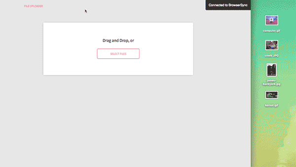

# Image Uploader

A little jquery plugin that creates and styles a UI for uploading a set of files to the server. It includes rendering little thumbnails
when it can, and letting the user add or remove files before sending them up.

On submit, the plugin submits an ajax request containing the files as formdata.

## Getting Started

* You'll need to include jquery.uploader.js in your site's Javascript.

* You should have a section of your page that you want the uploader to take over. The uploader will work on a div or section, and will
empty it before setting up. I suggest having a non-js solution in this section, so that when the uploader starts up, it can clear your nonjs solution in favor of itself.

* Start it up by calling the plugin on the section it's supposed to take over.

    $('.upload-box').uploader(options);

*  **The uploader will not start up if the browser doesn't support FormData (< IE10).**

*  **The uploader will not draw thumbnails if the browser doesn't support FileReader (< IE10)**

* The included styling is optional, if you like the default, include styles.uploader.css in your site's css

## Options
You can set certain things in the options object, like this:

    var options = {
        optionName: optionValue
    }

Here's the options you can set:

* submitButtonCopy - What you want the upload submit button to say
* instructionsCopy - What the instructions inside the box say
* furtherInstructions - What the instructions outside the box say
* selectButtonCopy - What the primary file select button says
* secondarySelectButtonCopy - What the secondary file select button says
* dropZone - the JQuery element where the uploader should listen for drops (defaults to $('body'))
* fileTypeWhiteList - The whitelist of file extensions to allow
* badFileTypeMessage - What the bad file error says
* ajaxUrl - The url to send the file batch to when its submitted

## Styling the Uploader yourself

Here's the classes you'll need to style, take a look at the scss directory for what I did:

* uploader__box
* uploader__hide
* uploader__icon
* uploader__instructions
* uploader__contents
* uploader__file-label
* uploader__file-label--secondary
* uploader__file-input
* uploader__file-input--secondary
* uploader__submit-button
* uploader__further-instructions
* uploader__file-list
* uploader\__file-list__item
* uploader\__file-list__text
* uploader\__file-list__size
* uploader\__file-list__button

## Is the uploader unit tested?

  Kinda. I wrote tests for the public interface, but I'm not particularly good at writing unit tests. You can run them by:

    npm run tests

## Contribution

  I haven't thought this through yet. If you fork the project, you can build it by doing:

    npm run build

  You can do other stuff too:

  * npm run js - build just the javascript part
  * npm run js:watch - build and watch js files
  * npm run scss - build just the css part
  * npm run scss:watch - build and run scss files
  * npm start - run an instance of it with browser-sync (localhost:3000)
  * npm test - run the js unit tests

  Enjoy!
